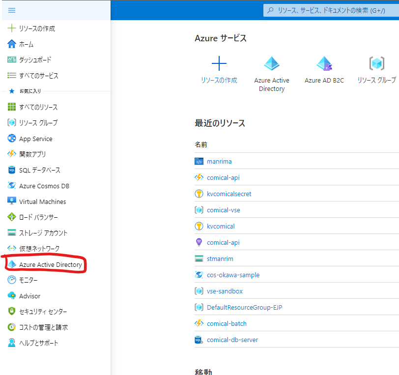

[←環境構築](./0-preparation.md)

# Azure AD アプリケーションを作成する

Azureポータルから認証で使用するAzure ADアプリケーションを作成します。

[Azureポータル](https://portal.azure.com/)にアクセスします。

Azure Active Directoryから「アプリの登録」でAzure ADアプリケーションの登録画面に移動します。

「アプリの登録」から「新規登録」で新しいAzure ADアプリケーションの作成を行います。

下記の内容で設定します。

|設定項目|設定内容| 備考 |
| -- | -- | -- |
| 名前 | Azure ADアプリケーションの名称を任意で設定(eg.SampleApp等) |
| サポートされているアカウントの種類 | 	この組織ディレクトリのみに含まれるアカウント ([テナント名] のみ - シングル テナント) | Outlookなど個人アカウントを使用したい場合は個人のMicrosoftアカウントが含まれているものを選択 |
| リダイレクトURI | シングルページアプリケーション(SPA) http://localhost:5500 | |

作成されたアプリケーションのアプリケーション(クライアント)IDとディレクトリ(テナント)IDを控えておきます。

[Microsoft Graphを利用するWebアプリケーションを作る→](2-make-web-app.md)

# このページの参考ドキュメント

[Microsoft Graph Toolkit で使用する Azure Active Directory アプリを作成します](https://docs.microsoft.com/ja-jp/graph/toolkit/get-started/add-aad-app-registration)