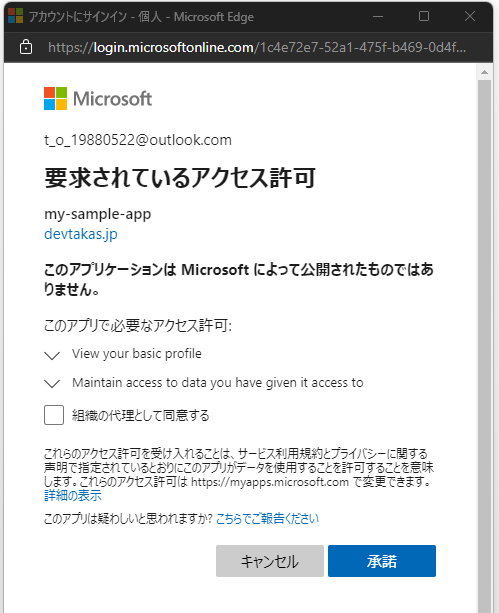

[←Azure ADアプリケーションを作る](./1-make-ad-app.md)

# まずは簡単なアプリが動作可能か確認する

適当なディレクトリにWebアプリケーションを作成していきます。

まずは`index.html`を作成し、下記のHTMLを記述します。

``` html
<html>
  <head></head>
  <div>
    Hello
  </div>
</html>
```

Live Serverを実行します


`http://localhost:5500`で下記のような画面が開かれればOKです。


# msalを取得する

Azure ADを利用した認証を助けてくれるライブラリ`msal`を使用できるように設定します。

下記のように`head`タグの中に埋め込みます。

``` html
<head>
  <script type="text/javascript" src="https://alcdn.msauth.net/browser/2.19.0/js/msal-browser.min.js"></script>
</head>
```

次に認証フローを実装していきます。

下記のスクリプトタグをHTMLタグ内の末尾に記述します。

``` html
<script>
  const myMSALObj = new msal.PublicClientApplication({
      auth: {
          clientId: '<前段階で取得したアプリケーションID>',
          authority: 'https://login.microsoftonline.com/<前段階で取得したテナントID>/'
      }
  });
  myMSALObj.loginPopup().then(x => {
      alert('loginsuccess')
  });
</script>
```

変更を保存したあと、下記のようなアプリケーションのアクセス許可画面が表示されたら成功です。

許諾してあげましょう。



今の段階のHTMLは下記のようになっていればOKです。

``` html
<html>
  <head>
    <script type="text/javascript" src="https://alcdn.msauth.net/browser/2.19.0/js/msal-browser.min.js"></script>
  </head>
  <div>
    Hello
  </div>
  <script>
    const myMSALObj = new msal.PublicClientApplication({
        auth: {
            clientId: '<前段階で取得したアプリケーションID>',
            authority: 'https://login.microsoftonline.com/<前段階で取得したテナントID>/'
        }
    });
    myMSALObj.loginPopup().then(x => {
        alert('loginsuccess')
    });
  </script>
</html>
```

# いい感じのログインボタンを実装してみる

ログインボタンを実装してみます。

ログイン後はログインボタンに用はないのでボタン部分はユーザー情報が表示されるようにしてみましょう。

まずはHTMLを構成します。

``` html
<html>
  <head>
    <script type="text/javascript" src="https://alcdn.msauth.net/browser/2.19.0/js/msal-browser.min.js"></script>
  </head>
  <div>
    <button id="login">ログイン</button>
  </div>
  <div id="contents"></div>
  <div id="agenda"></div>
  <script>
  </script>
</html>
```

スクリプト部は下記のように記述します。

先程実装したログイン処理を異なりネストしまくるとソースが見にくくなってしまうのでasync/awaitを使用しています。

何を行っているかはコメントを参照してください。

``` html
<script>
  // 認証オブジェクトを作成
  const myMSALObj = new msal.PublicClientApplication({
    auth: {
      clientId: '<前段階で取得したアプリケーションID>',
      authority: 'https://login.microsoftonline.com/<前段階で取得したテナントID>/'
    }
  });

    const btn = document.getElementById('login');

    const  loginAction = async () => {
      // ポップアップでログイン処理を実行
      const loginResult = await myMSALObj.loginPopup({ scopes: ['user.read'] });

      // 以降ログインが成功したときの処理
      // ログインボタンを消す
      btn.remove();

      // Microsoft Graphのユーザー情報にアクセスするためのアクセストークンの取得
      const res = await myMSALObj.acquireTokenSilent({scopes: ['user.read'], account: loginResult.account});

      // ユーザー情報をMicrosoft Graph経由で取得
      const headersInfo = new Headers();
      headersInfo.append('Authorization', `Bearer ${res.accessToken}`);
      const options = {
        method: 'GET',
        headers: headersInfo
      };
      const fres = await fetch('https://graph.microsoft.com/v1.0/me', options);
      const data = await fres.json();

      // ユーザーアイコンをMicrosoft Graph経由で取得(アイコンを設定していない場合は404になる)
      const photores = await fetch('https://graph.microsoft.com/v1.0/me/photo/$value', options).catch(e => { return null;});
      let photoData = null;
      if (photores.ok) {
        photoData = await photores.blob();
      }

      const parent = document.getElementById('contents');
      const agenda = document.getElementById('agenda');

      // 取得したユーザー情報をHTML上に描画
      if (photoData) {
        const photoEl = document.createElement('img');
        const url = (window.URL || window.webkitURL).createObjectURL(photoData);
        photoEl.setAttribute('src', url);
        parent.appendChild(photoEl);
      }
      const userInfoEl = document.createElement('label');
      const content = document.createTextNode(data.displayName);
      userInfoEl.appendChild(content);
      userInfoEl.setAttribute('class', 'user-info');

      parent.appendChild(userInfoEl);
    }

    // ボタンのクリックイベントに作成したファンクションを付与
    btn.addEventListener('click', loginAction);
</script>
```

レイアウトを整えるためCSSを適用します。

``` css
<style>
  #contents {
    height: 25px;
    line-height: 25px;
  }
  img {
    height: 25px;
    border-radius: 50%;
    vertical-align: middle;
  }
  .user-info {
    vertical-align: middle;
  }
</style>
```

これで、Azure ADアプリケーションとMicrosoft Graphを利用したアプリケーションが作成できました。

# 例に上げた予定表情報の取得を行ってみる

## ①AzureADアプリケーションのアクセス許可


## ②ログイン

ログイン時に予定情報(カレンダー)へのスコープを指定する

``` js
// const loginResult = await myMSALObj.loginPopup({ scopes: ['user.read'] });
const loginResult = await myMSALObj.loginPopup({ scopes: ['user.read', 'calendars.read'] });
```

## ③アクセス要求と④アクセス許可

``` js
// const res = await myMSALObj.acquireTokenSilent({scopes: ['user.read'], account: loginResult.account});
const res = await myMSALObj.acquireTokenSilent({scopes: ['user.read', 'calendars.read'], account: loginResult.account});
```

## ⑤データ取得と画面への反映

下記を追加

``` js
const calres = await fetch('https://graph.microsoft.com/v1.0/me/calendar/calendarView?startDateTime=2021/11/01&endDateTime=2021/12/31', options);
const calendarData = await calres.json();
console.log(calendarData)
const ag = calendarData.value[0];
const agendaEl = document.createElement('label');
const agendaContent = document.createTextNode(`${ag.subject}(${ag.start.dateTime})`);
agendaEl.appendChild(agendaContent);

agenda.appendChild(agendaEl);
```

[Graph Tool Kitを利用してMicrosoft Graphを利用するWebアプリケーションを作る→](./3-using-toolkit.md)

# 関連ドキュメント

* [Microsoft Authentication Library (MSAL) の概要](https://docs.microsoft.com/ja-jp/azure/active-directory/develop/msal-overview)
* [AzureAD/microsoft-authentication-library-for-js](https://github.com/AzureAD/microsoft-authentication-library-for-js)
* [ユーザーの取得](https://docs.microsoft.com/ja-jp/graph/api/user-get?view=graph-rest-1.0&tabs=http)