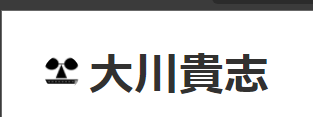
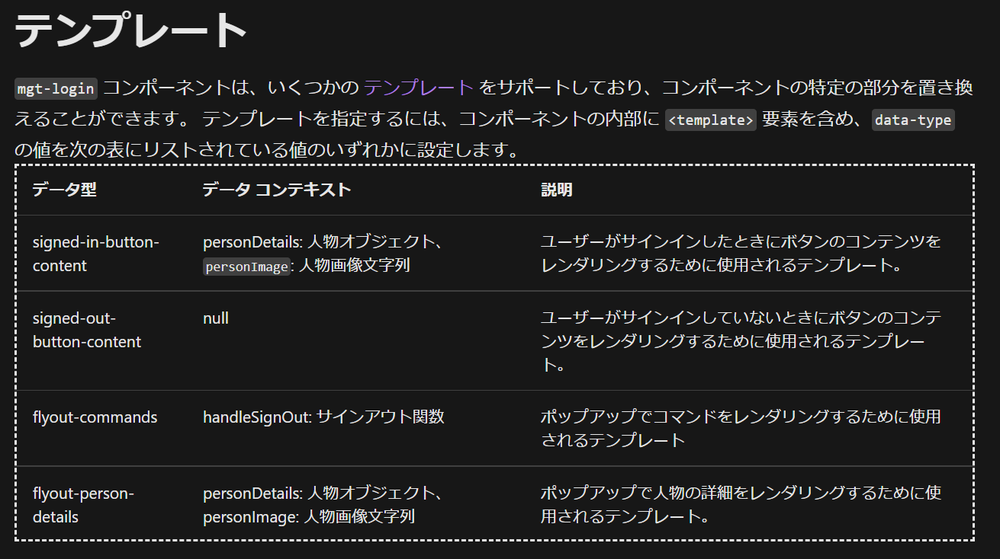
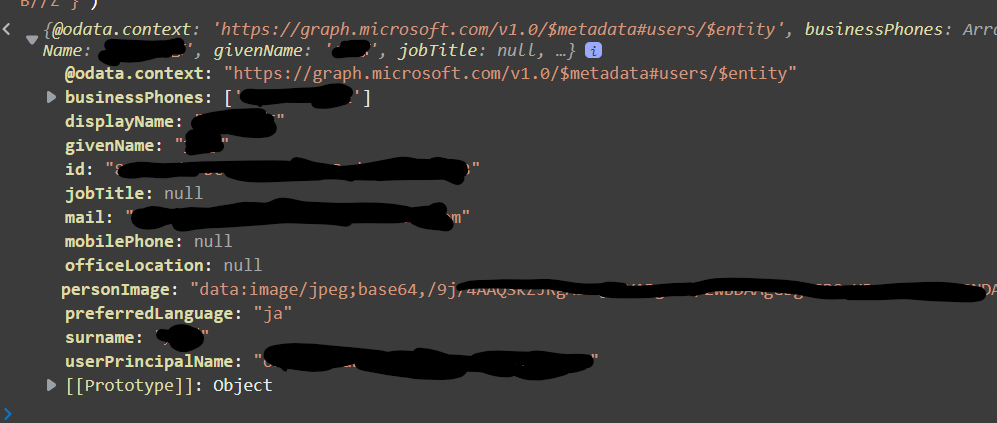

[←Graph Tool Kitを利用してMicrosoft Graphを利用するWebアプリケーションを作る](./3-using-toolkit.md)

Graph Tool Kitは便利ですが見た目など、使用しようとしているアプリケーションとマッチしない可能性があります。

色彩など簡単な変更内容から、表示されているテンプレートの構成をガラッと変更させることも可能です。

## スタイルのみの変更

特定の要素の外観を変更するためのインターフェース(カスタムプロパティ)が用意されており

簡単なレイアウトの変更であればそこから変更することが可能です。

先程作成したGraph ToolKitのログインコンポーネントの変更を行ってみます。

各Componentで用意されているインタフェースはドキュメントで確認することが可能です。

下記はログインコンポーネントのDocsで確認できる、mgt-loginで使用できるCSSのカスタムプロパティです。

``` css
mgt-login {
  --font-size: 14px;
  --font-weight: 600;
  --weith: '100%';
  --height: '100%';
  --margin: 0;
  --padding: 12px 20px;
  --button-color: #201f1e;
  --button-color--hover: var(--theme-primary-color);
  --button-background-color: transparent;
  --button-background-color--hover: #edebe9;
  --popup-background-color: white;
  --popup-command-font-size: 12px;
  --popup-color: #201f1e;
}
```

すこし極端な値に設定して、どのように反映されるか確認し見ます。

styleタグの中に下記のように設定します。

``` html
<style>
mgt-login {
  --font-size: 30px;
}
</style>
```

結果、下図のようにフォントサイズが大きくなって表示されます。



## テンプレートから変更

そもそも、テンプレートの構造から使用しているアプリケーションにそぐわないので変更したい場合があります。

その場合は`template`タグを使用し、中のコンテンツを自由に再構築することが可能です。

データの反映は テンプレートタグ内部で、`{{プロパティ名}}`で反映することが可能です。

どのようなデータが使用できるのかは、各ComponentのDocsの「テンプレート」部に記載があります。



例えば、サインインしたあとのボタンコンテンツを変更したい場合は`date-type`に`signed-in-button-content`を指定し、そこで使用できる情報は `personDetails` と `personImage` プロパティであることがわかります。

では、下記のような構成にしてみて、どのような情報が取得できるのか見てみましょう。

これは、`personDetails`構造体をJSON.stringifyで文字列化して表示しています。この構造体がどのようなプロパティを持っているのか確かめるためです。

``` html
<mgt-login>
  <template data-type="signed-in-button-content">
    {{JSON.stringify(personDetails)}}
  </template>
</mgt-login>
```

下図のようになりました。


すこしわかりにくいのですが、この長い文字列をパースすると下記のような状態になります。



と、いうわけで、`personDetails.givenName`や`personDetails.mail`などで、名前やメールアドレスの情報が取得できることがわかりました。

## 本格的にカスタマイズしてみる

さて、本格的に見た目をカスタマイズしてみます。

BootstrapベースのWebアプリケーションも多いと思うので、見た目をBootStrap風味にしてみましょう。

(無駄に)カードイメージにしてみます。

``` html
<html>
  <head>
    <link href="https://cdn.jsdelivr.net/npm/bootstrap@5.0.0-beta1/dist/css/bootstrap.min.css" rel="stylesheet" integrity="sha384-giJF6kkoqNQ00vy+HMDP7azOuL0xtbfIcaT9wjKHr8RbDVddVHyTfAAsrekwKmP1" crossorigin="anonymous">
    <script src="https://cdn.jsdelivr.net/npm/@popperjs/core@2.5.4/dist/umd/popper.min.js" integrity="sha384-q2kxQ16AaE6UbzuKqyBE9/u/KzioAlnx2maXQHiDX9d4/zp8Ok3f+M7DPm+Ib6IU" crossorigin="anonymous"></script>
    <script src="https://cdn.jsdelivr.net/npm/bootstrap@5.0.0-beta1/dist/js/bootstrap.min.js" integrity="sha384-pQQkAEnwaBkjpqZ8RU1fF1AKtTcHJwFl3pblpTlHXybJjHpMYo79HY3hIi4NKxyj" crossorigin="anonymous"></script>
    <script src="https://unpkg.com/@microsoft/mgt/dist/bundle/mgt-loader.js"></script>
  </head>
  <body>
    <mgt-msal2-provider client-id="<ClientId>"
      authority="https://login.microsoftonline.com/<TenantId>/"></mgt-msal2-provider>
    <mgt-login>
        <template data-type="signed-in-button-content">
          <div class="card" style="width: 18rem;">
            
            <div class="card-body">
              <h5 class="card-title">{{personDetails.displayName}}</h5>
              <p class="card-text">{{personDetails.mail}}</p>
            </div>
          </div>
        </template>
    </mgt-login>
  </body>
</html>
```

上記のコードでBootstrapの`Card`ベースでレイアウトが組み直されることを確認できます。

[mg-getで提供されていないリソースを利用する→](./5-use-mgt-get.md)

# 参考

* [Graph Tool Kit-スタイルコンポーネント](https://docs.microsoft.com/ja-jp/graph/toolkit/customize-components/style?view=graph-rest-1.0)
* [Graph Tool Kit-テンプレートコンポーネント](https://docs.microsoft.com/ja-jp/graph/toolkit/customize-components/templates?view=graph-rest-1.0)
* [Graph Tool Kit-ログインコンポーネント](https://docs.microsoft.com/ja-jp/graph/toolkit/components/login?context=graph%2Fapi%2F1.0&view=graph-rest-1.0)
* [BootStrap - Card](https://getbootstrap.jp/docs/5.0/components/card/)