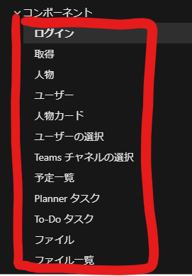
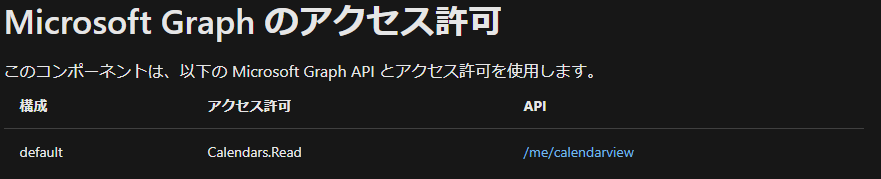
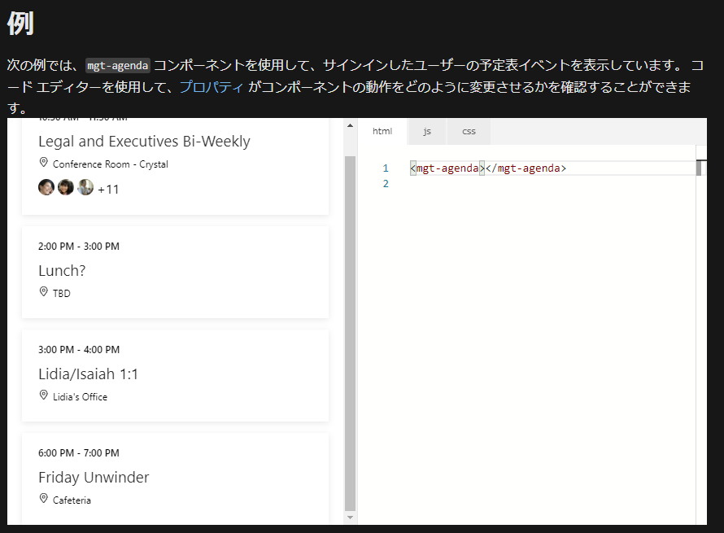
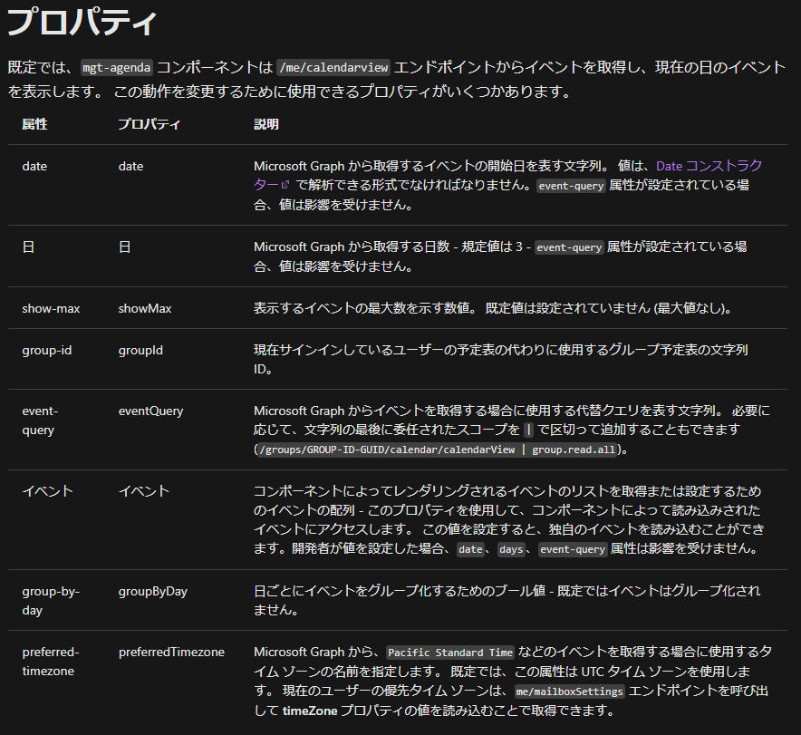
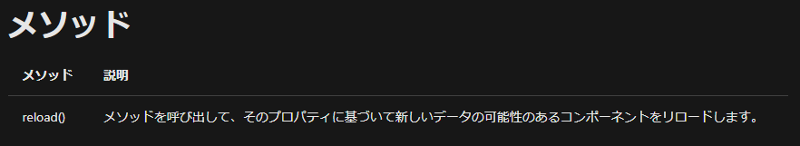

[←Graph Tool Kitを利用してMicrosoft Graphを利用するWebアプリケーションを作る(./4-using-toolkit)

`mgt-login`は自分の情報を表示しましたが表示したいのは自分の情報ばかりではありません。

Graph Toolkitから提供されている様々なプロパティを利用して、自分が考えるアプリケーションを作成していく必要があります。

そのために必要なのはドキュメントのどこに必要な情報が格納されているか知ることが重要です。

マイクロソフトから提供されているドキュメントを使いながらComponentの使い方を学んでいこうと思います。

予定を表示する[`mgt-agenda`](https://docs.microsoft.com/ja-jp/graph/toolkit/components/agenda)を使用して、その使い方の紐解き方を確認していきます。

# ドキュメントの確認

まずは使用したいComponentのドキュメントの確認です。

提供されているComponentは[ドキュメント](https://docs.microsoft.com/ja-jp/graph/toolkit/components/login?view=graph-rest-1.0)から参照できます。



あるいは[GitHubのComponents](https://github.com/microsoftgraph/microsoft-graph-toolkit#components)でもいいと思います。

今回は上に書いたとおり[予定一覧](https://docs.microsoft.com/ja-jp/graph/toolkit/components/agenda)を参照してみます。

## アクセス許可の確認

まずは「アクセス許可」の確認です。これを抑えておかないとデータの取得が行なえません。



必要なのは`Calendars.Read`なのでAzure ADアプリケーションでアクセス許可を与えておきます。

# 標準の動きを確認

ドキュメントの`例`の箇所で、標準的な使い方をするとどのような描画がされるか確認をすることができます。

また、ここではStorybookが使われているため、cssやHTMLをいじって実際に動作を確認することもできます。

データの抽出方法など、実際のデータを使用したほうが調査の場合以外、レイアウトの調整などを確認するときはここを利用するのも良いと思います。



# プロパティを確認する

HTMLタグのプロパティで検索条件や表示する内容などを変更することが可能です。

ドキュメントの`プロパティ`の箇所でComponentから提供されているプロパティを参照することが可能です。

`属性`側がHTMLテンプレートで記述する形式で、`プロパティ`がJavaScriptでオブジェクトを介して使用する形式です。



機械翻訳の結果翻訳されてしまっていますが、当然`属性`、`プロパティ`ともにすべて英語です。使用するときは英語ページを参照するなどして、正しい名称を抑えておく必要があります。

`属性`、`プロパティ`それぞれの使い方を簡単に確認してみます。

例えば属性とプロパティで名称が違う`group by day`で確認してみましょう。

属性は下記のように記述します。

``` html
<html>
  <head>
    <script src="https://unpkg.com/@microsoft/mgt/dist/bundle/mgt-loader.js"></script>
  </head>
  <body>
    <mgt-msal2-provider client-id="<ClientId>"
      authority="https://login.microsoftonline.com/<TenantId>/"></mgt-msal2-provider>
    <mgt-agenda group-by-day></mgt-agenda>
  </body>
</html>
```

文字通りHTMLの属性値として設定するイメージです。

プロパティは下記のように記述します。

``` html
<html>
  <head>
    <script src="https://unpkg.com/@microsoft/mgt/dist/bundle/mgt-loader.js"></script>
  </head>
  <body>
    <mgt-msal2-provider client-id="<ClientId>"
      authority="https://login.microsoftonline.com/<TenantId>/"></mgt-msal2-provider>
    <mgt-agenda></mgt-agenda>
  </body>
  <script>
    const docs = document.querySelector('mgt-agenda');
    docs.groupByDay = true;
  </script>
</html>
```

JavaScriptからアクセスできる利点は数多くあります。

わかりやすく、日付値の設定をトリガーに抽出条件を動的に変化させるようにアプリケーションを組んでみましょう。

``` html
<html>
  <head>
    <script src="https://unpkg.com/@microsoft/mgt/dist/bundle/mgt-loader.js"></script>
  </head>
  <body>
    <mgt-msal2-provider client-id="<ClientId>"
      authority="https://login.microsoftonline.com/<TenantId>/"></mgt-msal2-provider>
    <input type="date" placeholder="イベント取得開始日" id="inputdate"/>
    <mgt-agenda date="2021-11-07"></mgt-agenda>
  </body>
  <script>
    const inpd = document.getElementById('inputdate');
    inpd.addEventListener('change', (event) => {
      const value = event.target.value;
      const agenda = document.querySelector('mgt-agenda');
      agenda.date = value;
    });
  </script>
</html>
```

# メソッド

ドキュメントの`メソッド`の箇所でComponentから提供されている処理を実行するすためのメソッドが提供されています。



これの実行の仕方も確認します。

``` html
<html>
  <head>
    <script src="https://unpkg.com/@microsoft/mgt/dist/bundle/mgt-loader.js"></script>
  </head>
  <body>
    <mgt-msal2-provider client-id="<ClientId>"
      authority="https://login.microsoftonline.com/<TenantId>/"></mgt-msal2-provider>
    <input type="date" placeholder="イベント取得開始日" id="inputdate"/>
    <mgt-agenda date="2021-11-07"></mgt-agenda>
    <button id="reloadbutton">画面更新</button>
  </body>
  <script>
    const agenda = document.querySelector('mgt-agenda');
    const inpd = document.getElementById('inputdate');
    inpd.addEventListener('change', (event) => {
      const value = event.target.value;
      agenda.date = value;
    });
    const rb = document.getElementById('reloadbutton');
    rb.addEventListener('click', () => {
      agenda.reload();
    });
  </script>
</html>
```

表示されているイベント変更した後`画面更新`ボタンを押してみます。

画面に表示される内容が変化するはずです。

動的に変化するアプリケーションが簡単に構築できることがわかりました。

このようにComponentを利用/または検証を行う際は、まずドキュメントを参照しながら触っていくのが定石です。

[Componentをカスタマイズする](./6-custom-component.md)