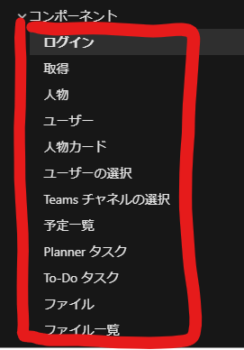

[←mg-getで提供されていないリソースを利用する](./5-use-mgt-get.md)

Graph Tool Kitは標準で様々なComponentが提供されています。いろいろなComponentを試してみましょう。

どのようなComponentでも共通して踏まなければ行けない手順があるので、それを見ていきます。

# ドキュメントを確認する

まずは使用したいComponentのドキュメントの確認です。

提供されているComponentは[ドキュメント](https://docs.microsoft.com/ja-jp/graph/toolkit/components/login?view=graph-rest-1.0)から参照できます。



あるいは[GitHubのComponents](https://github.com/microsoftgraph/microsoft-graph-toolkit#components)でもいいと思います。

今回は[予定一覧](https://docs.microsoft.com/ja-jp/graph/toolkit/components/agenda)を参照してみます。

## アクセス許可の確認

まずは「アクセス許可」の確認です。これを抑えておかないとデータの取得が行なえません。


必要なのは`Calendars.Read`なのでAzure ADアプリケーションでアクセス許可を与えておきます。

## 使い方の確認


### まずは基本の使い方

「例」のセクションにあるHTMLタグを使用して、データ取得できるか試してみます。


### プロパティをいじってみる

「プロパティ」セクションにある属性をHTMLタグからいじって使い方を確認してみましょう。

**属性名もプロパティも翻訳されてしまっていますが、英語名での表記になります。**


## カスタマイズを行う場合

スタイルのみのカスタマイズなら「CSSカスタムプロパティ」。

中身をごそっと書き換えたい場合は「テンプレート」のセクションを確認します。

# すこし凝ったテンプレートの組み立て方

## 配列データの表示

[data-for](https://docs.microsoft.com/ja-jp/graph/toolkit/customize-components/templates#looping)を使用することで、テンプレートないでデータ配列数分ループが行えます。

イベントの一覧など、List形式のデータを表示する場合によく利用します。

``` html
<template data-type="event">
  <ul>
    <li data-for='attendee in event.attendees'>
      {{ attendee.displayName }}
    </li>
  </ul>
</template>
```

### 条件付きのデータの表示

特定のデータのみ表示/非表示にしたい場合は[`data-if`/`data-else`](https://docs.microsoft.com/ja-jp/graph/toolkit/customize-components/templates#conditional-rendering)を利用します。

``` html
<mgt-person person-query="john doe">
  <template>
    <div data-if="person.image">
      
    </div>
    <div data-else>
      {{ person.displayName }}
    </div>
  </template>
</mgt-person>
```

# JavaScriptからのComponentへのアクセス

たとえば、より細かな制御で動的にレンダリングを制御したいとき、Componentが発火させるイベントを引っ掛けたいときなどに、JavaScriptからComponentにアクセスして利用することが可能です。

Componentが提供するイベントは同じくDocsの「イベント」セクションから確認できます。

`eventClick`発火時に追加で処理を実装したい場合は下記のように実装します。

``` js
// querySelectorで対象のコンポーネントを引っ掛ける。
// 同一のコンポーネントを複数使用している場合はidやclass、nameなどを使用します。
const doc = document.querySelector('mgt-agenda');
// Componentのイベントの処理を追加します
doc.addEventListener('eventClick', e => { console.log(e) })
```