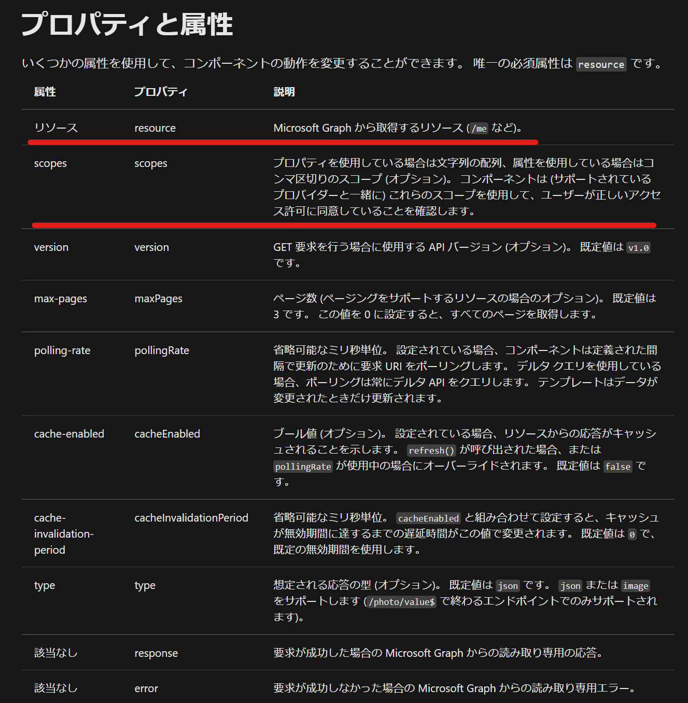

[←すこし凝ったテンプレートの組み立て方→](./7-7-use-any-component.md)

# mgt-getを使用する

Componentが提供されていないリソースへのアクセスも`mgt-get`を使用することでアクセス可能です。`mgt-get`を使用してみましょう。

## 先に作ったアプリケーションをカスタマイズする

先に作ったアプリケーションに、ユーザーの状態(プレゼンス)を表示してみます。

## まずはリソースの確認

何はともあれ、[ドキュメント](https://docs.microsoft.com/ja-jp/graph/api/presence-get?view=graph-rest-1.0&tabs=http)を確認します。

まず確認しなくてはいけないのは「アクセス許可」です。Azure ADアプリケーションでアクセス許可が得れる状態にしておかないと、そのリソースにアクセスできません。

ドキュメントでは下図のように記載されています。


そのため、まずは、Azure ADアプリケーションでアクセス許可を与えます。

Azure ADアプリケーションで「API Permission」から「Microsoft Graph」を選択します


Microsoft GraphのPermissionから先程ドキュメントで確認した`Presence.Read`を選択し追加します。


ここから、`mgt-get`を使用していきます。[ドキュメント](https://docs.microsoft.com/ja-jp/graph/toolkit/components/get?view=graph-rest-1.0)で使い方を確認します。

Componentのプロパティに取得するリソースなどを指定します。今回重要と思われるのは下図のとおりでしょうか。



取得するURLを指定するのでリソースは言わずもがなですね。

データを取得するためにアクセス時に許可を得る必要があります。PresenceのドキュメントにあるURLの`/me/presence`を指定します。

scopesで先程Azure ADアプリケーションに設定した`Presence.Read`を指定します。

まずは、雑にデータが取得できるか見てみます。

テンプレートで使用できる値は下記の通りですが、ひとまず`default`を`data-type`に指定します。


[テンプレートでは雑に`this`でできるとある](https://docs.microsoft.com/ja-jp/graph/toolkit/customize-components/templates#this)ので、thisでアクセスしてみます。

今回は画面にアクセスせずにコンソールにデータを表示してみましょう。

下記のような構成を貼り付けてみます。

``` html
<mgt-get resource="/me/presence" scopes="Presence.Read">
    <template data-type="default">
        {{console.log(this)}}
    </template>
</mgt-get>
```

結果、下記のようなデータが取得できました。


`activity`の対応表は[Docs](https://docs.microsoft.com/en-us/microsoftteams/presence-admins)にある下図とおりです。


これを踏まえて、下記の通り変更してみます。

すべてHtmlでやるのは無理があったので、一部ファンクションを分離しました。アイコンなんかの識別子を返すようにしても面白いかもしれません。


``` html
<html>
  <head>
    <link href="https://cdn.jsdelivr.net/npm/bootstrap@5.0.0-beta1/dist/css/bootstrap.min.css" rel="stylesheet" integrity="sha384-giJF6kkoqNQ00vy+HMDP7azOuL0xtbfIcaT9wjKHr8RbDVddVHyTfAAsrekwKmP1" crossorigin="anonymous">
    <script src="https://cdn.jsdelivr.net/npm/@popperjs/core@2.5.4/dist/umd/popper.min.js" integrity="sha384-q2kxQ16AaE6UbzuKqyBE9/u/KzioAlnx2maXQHiDX9d4/zp8Ok3f+M7DPm+Ib6IU" crossorigin="anonymous"></script>
    <script src="https://cdn.jsdelivr.net/npm/bootstrap@5.0.0-beta1/dist/js/bootstrap.min.js" integrity="sha384-pQQkAEnwaBkjpqZ8RU1fF1AKtTcHJwFl3pblpTlHXybJjHpMYo79HY3hIi4NKxyj" crossorigin="anonymous"></script>
    <script src="https://unpkg.com/@microsoft/mgt/dist/bundle/mgt-loader.js"></script>
    <script>
      genStatus = (activity) => {
        switch (activity.toLowerCase()) {
          case 'away':
            return '離席'
          case 'available':
            return '連絡可能'
          case 'busy':
            return '対応不可'
          case 'do not disturb':
            return '会議中'
          case 'be right back':
            return 'すぐ戻る予定'
          case 'appear offline':
            return 'オフライン'
          default:
            break;
        }
      }
    </script>
  </head>
  <body>
    <mgt-msal2-provider client-id="<ClientId>"
      authority="https://login.microsoftonline.com/<TenantId>/"></mgt-msal2-provider>
    <mgt-login>
        <template data-type="signed-in-button-content">
          <div class="card" style="width: 18rem;">
            
            <div class="card-body">
              <h5 class="card-title">
                {{personDetails.displayName}}
                <mgt-get resource="/me/presence" scopes="Presence.Read">
                  <template data-type="default">
                    ({{genStatus(this.availability)}})
                  </template>
                </mgt-get>
              </h5>
              <p class="card-text">{{personDetails.mail}}</p>
            </div>
          </div>
        </template>
    </mgt-login>
  </body>
</html>
```

[まとめ→](./9-summary.md)

# 関連ドキュメント

* [プレゼンスを取得する](https://docs.microsoft.com/ja-jp/graph/api/presence-get?view=graph-rest-1.0&tabs=http)
* [Microsoft Graph ツールキット Get コンポーネント](https://docs.microsoft.com/ja-jp/graph/toolkit/components/get?view=graph-rest-1.0)
* [テンプレートコンポーネント](https://docs.microsoft.com/ja-jp/graph/toolkit/customize-components/templates#binding-data)
* [User presence in Teams](https://docs.microsoft.com/en-us/microsoftteams/presence-admins)